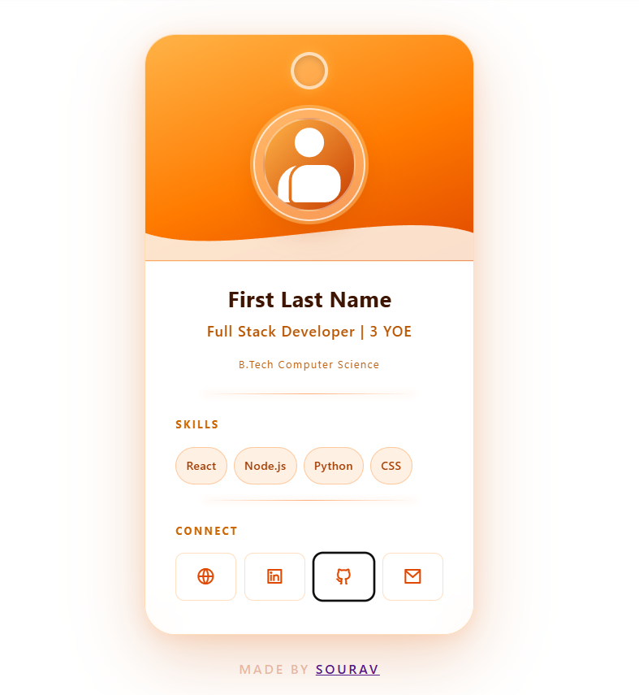
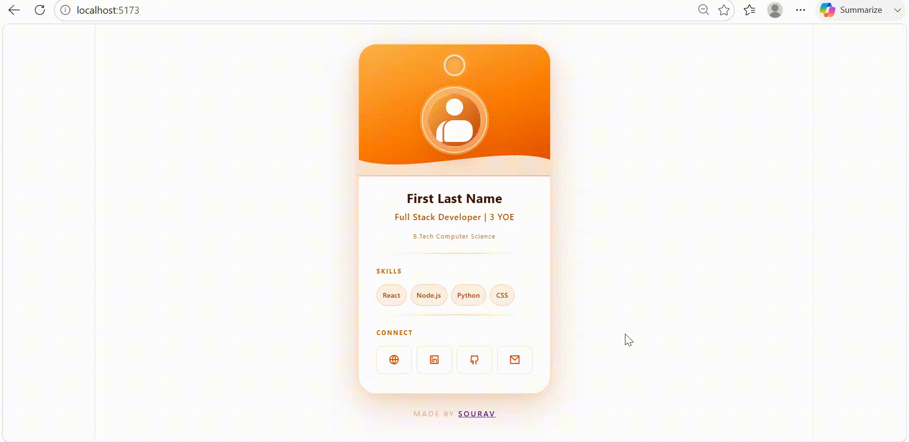

# 🪪 Digital Developer ID Card

> A glassmorphism-styled digital identity card for developers — built with React & TypeScript. No coding required. Just update a JSON file and your card is ready.




---

## ✨ What is this?

Everyone has a portfolio website. But corporates have **ID cards**.

So I built one for all.

This project generates a sleek, professional digital ID card that shows your identity at a glance — name, designation, experience, education, major skills, and social links. All powered by a single JSON file. No React knowledge needed. No CSS tweaking. Just your details.

> Built while learning React — this is my hands-on learning project combining React, TypeScript, Glassmorphism UI, and Dev Containers.

---

## 🖼️ Features

- 🎨 **Glassmorphism UI** — modern frosted glass design with an orange gradient theme
- 📄 **JSON-powered** — update all your details from a single JSON file, zero code changes
- ⚛️ **React + TypeScript** — built with modern React practices
- 🐳 **Dev Container ready** — instant, consistent dev environment with Docker
- 📱 **Clean & minimal** — shows only what matters: name, role, YOE, education, skills, links
- 🔗 **Social links** — portfolio, LinkedIn, GitHub, and email icons built in
- ⚡ **Zero setup headache** — one script gets you running

---

## 🚀 Getting Started

### Option 1 — Dev Container (Recommended)

The easiest way. No manual setup needed.

1. Install [Docker Desktop](https://www.docker.com/products/docker-desktop/)
2. Install [VS Code](https://code.visualstudio.com/) with the [Dev Containers extension](https://marketplace.visualstudio.com/items?itemName=ms-vscode-remote.remote-containers)
3. Clone the repo:
   ```bash
   git clone https://github.com/souravkh/Digital-Id-Card.git
   cd Digital-Id-Card
   ```
4. Open in VS Code and click **"Reopen in Container"** when prompted
5. The container sets everything up automatically

### Option 2 — Manual Setup

```bash
git clone https://github.com/souravkh/Digital-Id-Card.git
cd Digital-Id-Card
chmod +x setup.sh
./setup.sh
```

Or manually:

```bash
cd src/digital-id-card
npm install
npm start
```

---

## 🛠️ Make It Yours — No Coding Required!

Open the JSON config file and fill in your details:

```json
{
  "name": "Your Name",
  "designation": "Full Stack Developer",
  "experience": "3",
  "education": "B.Tech Computer Science",
  "skills": ["React", "Node.js", "Python", "CSS"],
  "links": {
    "portfolio": "https://yourportfolio.com",
    "linkedin": "https://linkedin.com/in/yourprofile",
    "github": "https://github.com/yourusername",
    "email": "you@email.com"
  }
}
```

Save the file. Your card updates instantly. That's it. ✅

---

## 🧰 Tech Stack

| Technology | Purpose |
|---|---|
| React | UI framework |
| TypeScript | Type-safe JavaScript |
| CSS | Glassmorphism styling |
| Docker | Containerization |
| Dev Containers | Consistent dev environment |

---

## 📁 Project Structure

```
Digital-Id-Card/
├── .devcontainer/         # Dev Container configuration
│   └── devcontainer.json
├── src/
│   └── digital-id-card/   # React app
│       ├── src/
│       │   ├── components/
│       │   ├── data/       # Your JSON config lives here
│       │   └── App.tsx
│       └── package.json
├── setup.sh               # One-command setup script
└── README.md
```

---

## 💡 Why I Built This

I've been learning React and wanted to build something real — not just a todo app.

The idea hit me when I noticed developers spend weeks building portfolio websites, but corporates communicate everything with a simple ID badge. So I combined both worlds: a developer-focused digital ID card that's as fast to set up as filling a form.

This project helped me learn:
- React component architecture
- TypeScript with React
- Glassmorphism CSS techniques
- Docker & Dev Containers for consistent environments
- JSON-driven dynamic UI

---

## 🤝 Contributing

Want to add features or improve the card? Contributions are welcome!

1. Fork the repo
2. Create your feature branch: `git checkout -b feature/your-feature`
3. Commit your changes: `git commit -m 'Add your feature'`
4. Push to the branch: `git push origin feature/your-feature`
5. Open a Pull Request

---

---
## ⭐ Show Your Support

If this project helped you or you liked the idea, please consider giving it a **star** on GitHub — it means a lot and helps others discover it!

---

## 📄 License

This project is open source and available under the [MIT License](LICENSE).

---

> Made with 🧡 while learning React | [@souravkh](https://github.com/souravkh)
